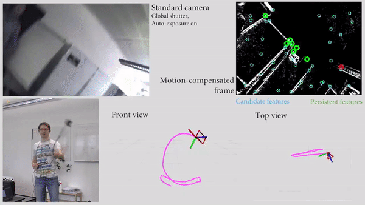

# Ultimate SLAM

<p align="center">
    <a href="https://youtu.be/0hDGFFJQfmA">
        
    </a>
</p>

This repository contains code to run Ultimate SLAM, described in the following two papers:  
- [Ultimate SLAM? Combining Events, Images, and IMU for Robust Visual SLAM in HDR and High Speed Scenarios](http://rpg.ifi.uzh.ch/docs/RAL18_VidalRebecq.pdf), IEEE Robotics and Automation Letters, 2018.
- [Real-time Visual-Inertial Odometry for Event Cameras using Keyframe-based Nonlinear Optimization](http://rpg.ifi.uzh.ch/docs/BMVC17_Rebecq.pdf), British Machine Vision Conference, 2017.

Check out the [presentation video here](https://youtu.be/0hDGFFJQfmA)

If you use this code in an academic context, please cite the following works:

```bibtex
@InProceedings{Rosinol_2018_RAL,
  author = {Antoni Rosinol Vidal and Henri Rebecq and Timo Horstschaefer and Davide Scaramuzza},
  title = {Ultimate SLAM? Combining Events, Images, and IMU for Robust Visual SLAM in HDR and High Speed Scenarios},
  booktitle = {{IEEE} Robotics and Automation Letters (RA-L)},
  year = {2018}
}
```

```bibtex
@InProceedings{Rebecq_2017_BMVC,
  author = {Henri Rebecq and Timo Horstschaefer and Davide Scaramuzza},
  title = {Real-time Visual-Inertial Odometry for Event Cameras using Keyframe-based Nonlinear Optimization},
  booktitle = {British Machine Vision Conference (BMVC)},
  year = {2017}
}
```
## Motivation
Event cameras are bioinspired vision sensors that output pixel-level brightness changes instead of standard intensity frames. Event cameras do not suffer from motion blur and have a very high dynamic range, which enables them to provide reliable visual information during high-speed motions or in scenes characterized by high dynamic range. However, event cameras output only a little information when the amount of motion is limited, such as in the case of almost still motion. Conversely, standard cameras provide instant and rich information about the environment most of the time (in low-speed and good lighting scenarios), but they fail severely in case of fast motions, or difficult lightings such as high dynamic range or low light scenes. UltimateSLAM is the first state estimation pipeline that leverages the complementary advantages of these two sensors by fusing in a tightly coupled manner events, standard frames, and inertial measurements. In high-speed and high-dynamic-range scenarios, UltimateSLAM leads to an accuracy improvement of up to 85% over standard frame-based visual-inertial odometry systems and can run in real-time on embedded platforms. We have shown that UltimateSLAM can be used for autonomous drone flight in low-lit environments and even to keep drones flying when a rotor fails ([video](https://youtu.be/Ww8u0KH7Ugs)).

## Contents
- [Installation of UltimateSLAM](docs/Installation-of-UltimateSLAM.md)
- [Run Examples](docs/Run-Examples.md)
- [Camera Calibration](docs/Camera-Calibration.md)
- [Run Live Demo](docs/Run-Live-Demo.md)
- [Parameter Tuning Guide](docs/Parameter-Tuning-Guide.md) 
